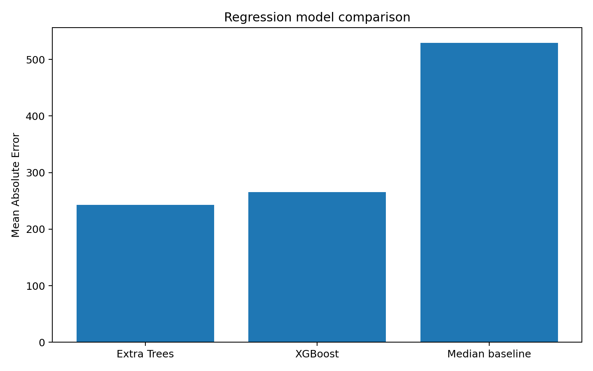
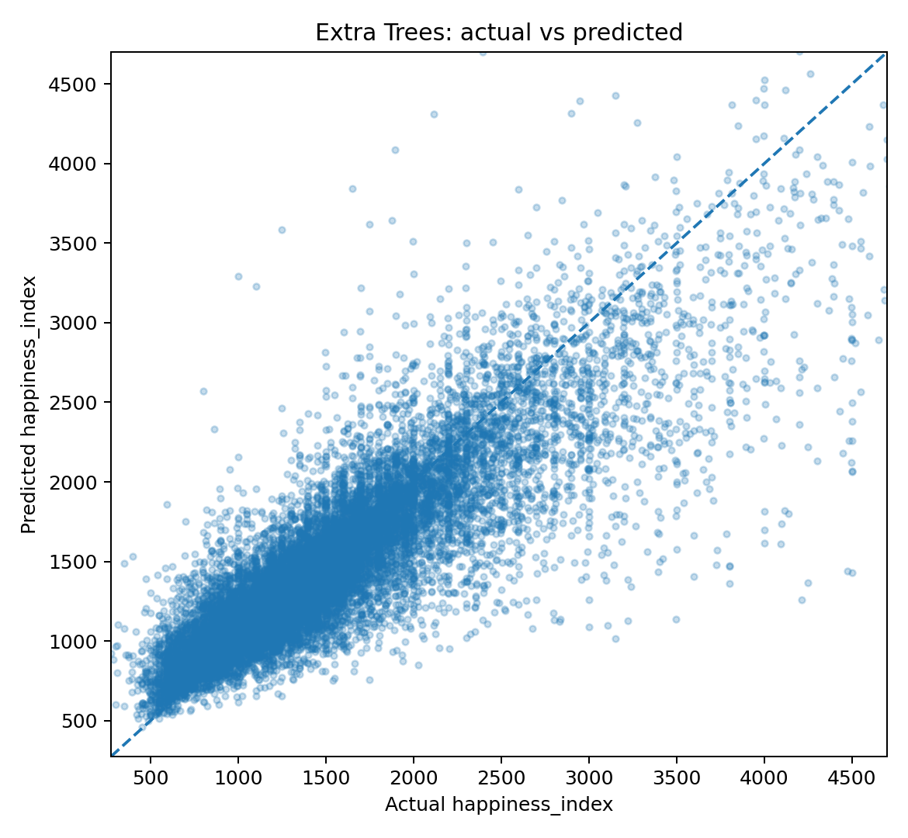
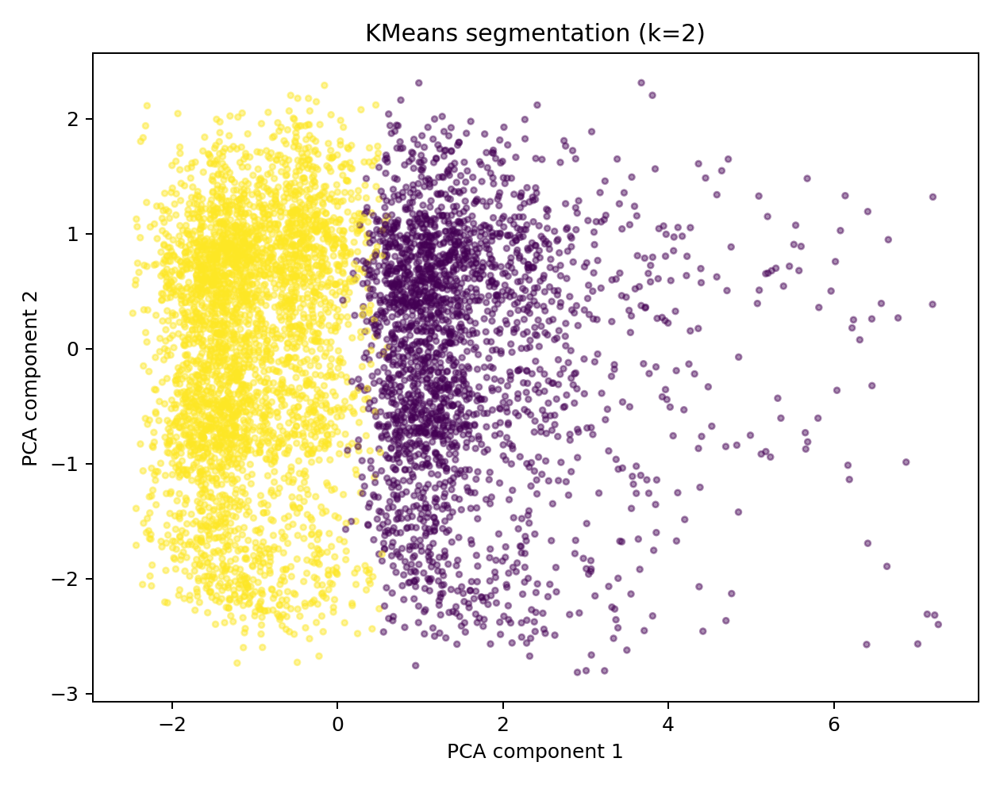

# Euphoria Machine Learning Analysis

Group academic project developed as part of an **Artificial Intelligence and Machine Learning** course during my Bachelor's degree.

The project applies **supervised regression** and **unsupervised clustering** to the Euphoria dataset, combining data cleaning, feature engineering, model evaluation and exploratory segmentation.

---

## Project Overview

The dataset contains **99,492 observations and 19 original variables** describing islands in the fictional Euphoria setting.

The analysis focuses on two objectives:

1. **Predict `happiness_index`** using regression models.
2. **Explore island segments** using K-Means clustering.

A significant part of the project involves data preparation, as the raw dataset contains missing values and irregular CSV formatting that require dedicated preprocessing before modelling.

---

## Key Features

- Data cleaning and reconstruction of irregular CSV records
- Missing-value handling and type conversion
- Feature engineering
- Train/test split with preprocessing fitted only on training data
- Regression modelling with **Extra Trees** and **XGBoost**
- Explicit median baseline for model comparison
- Evaluation using **MAE, RMSE and R²**
- K-Means clustering across multiple values of `k`
- Cluster evaluation using **Silhouette Score** and **Davies-Bouldin Index**
- PCA-based cluster visualisation
- Reproducible Python workflow

---

## Project Visuals

### Model Comparison



The regression models are compared against a simple median baseline using MAE, RMSE and R².

### Actual vs Predicted Happiness Index



The scatter plot compares predicted and observed values of `happiness_index` on the held-out test set.

### Island Segmentation



A PCA projection provides a two-dimensional visualisation of the clusters identified by K-Means.

---

## Regression Analysis

The target variable is **`happiness_index`**, treated as a continuous numerical outcome.

The dataset is split into training and test sets using a fixed random seed for reproducibility. Preprocessing is fitted only on the training data to avoid information leakage.

Three approaches are compared:

- Median baseline
- Extra Trees Regressor
- XGBoost Regressor

### Results

| Model | MAE | RMSE | R² |
|---|---:|---:|---:|
| Extra Trees | **243.2** | 531.5 | 0.658 |
| XGBoost | 265.9 | **522.5** | **0.669** |
| Median Baseline | 529.7 | 926.0 | -0.039 |

**Extra Trees** achieves the lowest mean absolute error, while **XGBoost** obtains the strongest RMSE and R² results.

Both models substantially outperform the baseline.

---

## Clustering Analysis

A separate unsupervised analysis applies **K-Means** to selected numerical characteristics.

Several values of `k` are evaluated rather than fixing the number of clusters in advance.

| k | Silhouette Score | Davies-Bouldin Index |
|---:|---:|---:|
| **2** | **0.160** | **2.217** |
| 3 | 0.117 | 2.369 |
| 4 | 0.103 | 2.669 |
| 5 | 0.092 | 2.566 |
| 6 | 0.091 | 2.421 |

Among the tested solutions, **k = 2** achieves the highest Silhouette Score and the lowest Davies-Bouldin Index.

The relatively low silhouette value indicates that the clusters are not sharply separated, so the clustering is interpreted as **exploratory segmentation rather than evidence of clearly distinct natural groups**.

---

## Methodology

### 1. Data Cleaning

The preprocessing workflow:

- reconstructs irregular CSV records;
- converts numerical and datetime variables;
- handles missing values;
- prepares a consistent modelling dataset.

### 2. Feature Preparation

Numerical and categorical variables are processed separately.

All transformations required by the regression models are fitted on the **training partition only** and then applied to the held-out test data.

### 3. Supervised Learning

The project compares tree-based regression models against a simple baseline.

Performance is evaluated using:

- **MAE** — Mean Absolute Error
- **RMSE** — Root Mean Squared Error
- **R²** — coefficient of determination

### 4. Unsupervised Learning

For clustering:

- selected numerical features are standardised;
- K-Means is tested for multiple values of `k`;
- Silhouette Score and Davies-Bouldin Index are used for evaluation;
- PCA is used for two-dimensional visualisation.

---

## Technologies

**Python** · **Pandas** · **NumPy** · **scikit-learn** · **XGBoost** · **Matplotlib** · **Jupyter**

---

## Repository Structure

```text
euphoria-machine-learning/
├── README.md
├── requirements.txt
├── run_analysis.py
│
├── assets/
│   ├── model_comparison.png
│   ├── actual_vs_predicted.png
│   └── clusters_pca.png
│
├── data/
│   ├── README.md
│   └── raw/
│
├── notebooks/
│   └── euphoria_analysis.ipynb
│
├── outputs/
│   ├── model_metrics.csv
│   ├── clustering_scores.csv
│   ├── cluster_profiles.csv
│   └── additional analysis outputs
│
├── src/
│   ├── data_cleaning.py
│   ├── modeling.py
│   └── clustering.py
│
└── tests/
    └── test_data_cleaning.py
```

---

## Running the Project

### 1. Create a virtual environment

```bash
python -m venv .venv
```

Activate it and install the dependencies:

```bash
pip install -r requirements.txt
```

### 2. Add the dataset

Place the original course dataset at:

```text
data/raw/euphoria_dataset.csv
```

The raw dataset is not included in the public repository because redistribution rights were not specified in the original course materials.

### 3. Run the analysis

```bash
python run_analysis.py
```

### 4. Run the tests

```bash
pytest
```

---

## Main Outputs

The workflow generates:

- model performance metrics;
- actual-vs-predicted analysis;
- feature-importance results;
- clustering evaluation scores;
- cluster profiles;
- PCA cluster visualisation.

---

## Academic Context

This project was developed as a **group academic project** for an Artificial Intelligence and Machine Learning course during my Bachelor's degree.

It combines concepts from **data preprocessing, supervised learning, model evaluation and unsupervised learning** in a reproducible Python workflow.

---

## Limitations

- The dataset documentation is limited, so variable meanings rely on the labels supplied with the course data.
- The dataset contains substantial missingness and irregular formatting.
- Regression performance is reported on one reproducible held-out test split.
- K-Means reveals only modest cluster separation, so the segmentation should not be over-interpreted.
